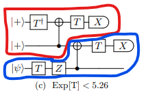

# Repeat-until-success

This is an example of a Repeat-Until-Success (RUS) algorithm implemented in a Q# program.
The algorithm has been described in [Adam Paetznick, Krysta M. Svore, Quantum Information & Computation 14(15 & 16): 1277-1301 (2014)](https://arxiv.org/abs/1311.1074).

The idea for the RUS algorithm originates from the goal of decomposing a single-qubit unitary operation into a sequence of gates from a given universal basis set. In general, the goal of a RUS algorithm is to reduce the number of Clifford gates needed to execute said unitary operation by using one or more auxiliary qubits that are measured during the execution of the algorithm to indicate whether the desired output state has been achieved. This specific RUS algorithm consists of a circuit that uses two auxiliary qubits, which we label `auxiliary` and `resource`, and one `target` qubit.

In this example, the RUS algorithm aims to apply exp(i⋅ArcTan(2)⋅Z) or a $V_3$-gate on the `target` qubit. The algorithm is based on the logic mapped out in the below circuit diagram (Fig. 1(c) from [source](https://arxiv.org/abs/1311.1074)). The qubits on the left hand side are labeled from top to bottom: `auxiliary`, `resource` and `target`. As described in the whitepaper, the desired operation will have been achieved when the measurements on both `auxiliary` and `resource` qubits returns `Zero`. When that happens we can exit the program and return the result. In all other cases, we would have to re-run the circuit. Important to note is that if the auxiliary qubit returns `Zero` but the `resource` qubit returns `One`, the resulting operation will have been an effective `Z` rotation which we will then need to correct for.



Since both the `auxiliary` and `resource` qubits need to return `Zero`, we can split this circuit into two parts, in the diagram circled in red and blue. If we execute the first part and it returns `One`, we can skip running the second part and start over. Since the first part doesn't perform any operations on the `target` qubit, we don't have to make any corrections on the `target` qubit and just reinitialize the `auxiliary` and `resource` qubit.

If we measure `Zero` on the `auxiliary` qubit, we run the second part and measure the `resource` qubit. If the measurement returns `Zero`, we measure the `target` qubit and exit the program successfully. If the measurement returns `One`, we need to apply an `Adjoint Z` operation on the `target` qubit as mentioned above.

The program returns a tuple with three values: whether the program ran successfully, the measurement result on the `target` qubit and the number of iterations that was run to obtain the result.

## Running the Sample

Browse to the `samples\algorithms\repeat-until-success` folder and run `dotnet build` to build the project. Then run `dotnet run [options] --no-build`. Optionally, omit the `--no-build` option to automatically build the project before execution.

Options are:
```
  --input-value <true|false> (REQUIRED)                     The input value to use.
  --input-basis <PauliI|PauliX|PauliY|PauliZ> (REQUIRED)    The input basis to use.
  --limit <limit> (REQUIRED)                                The repetition limit.
  -s, --simulator <simulator>                               The name of the simulator to use.
```

## Manifest

- **repeat-until-success/**
  - [RepeatUntilSuccess.csproj](./RepeatUntilSuccess.csproj): Main C# project for the example.
  - [Program.cs](./Program.cs): C# code to call the operations defined in Q# and perform classical post-processing.
  - [RepeatUntilSuccess.qs](./RepeatUntilSuccess.qs): The Q# implementation of the RUS algorithm.

## Example run ##

```
> dotnet run --no-build --input-value true --input-basis PauliZ --limit 10
(True, One, 3)
```
